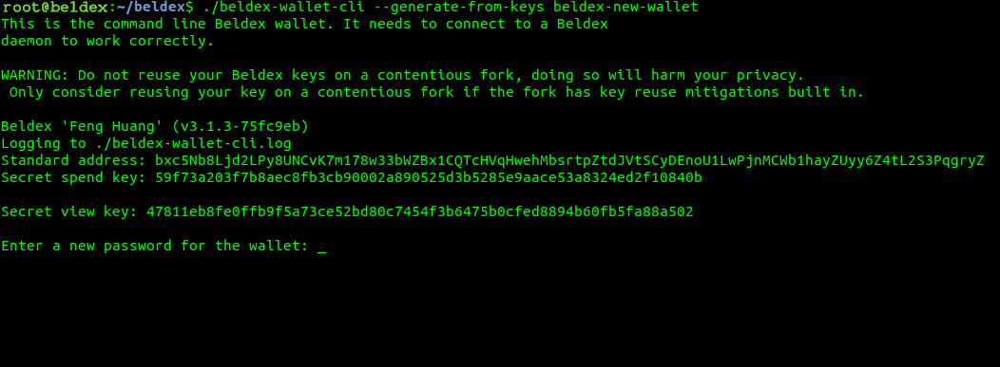

# CLI Restoring Wallet from Keys

If you have a Mnemonic Seed Phrase, restoring your wallet from it would probably be a good option. Otherwise, you can restore your wallet from private keys. You will need to have the following keys to proceed:

* Wallet public address
* Spend Key
* View Key

### Step 1: Download and unzip CLI wallet <a href="#step-1-download-and-unzip-cli-wallet" id="step-1-download-and-unzip-cli-wallet"></a>

* Download the latest release of wallet CLI software for your desired operating system: https://github.com/beldex-coin/be/reldex/releases
* Unzip `beldex-[operating-system]-[platform]-[version].zip` file


### Step 2: Run wallet in restore mode <a href="#step-2-run-wallet-in-restore-mode" id="step-2-run-wallet-in-restore-mode"></a>

* Open a [Command Prompt](https://en.wikipedia.org/wiki/Cmd.exe) (Windows) or [Terminal](https://en.wikipedia.org/wiki/Terminal\_emulator) (Linux / OSX) and navigate to the wallet folder
* Run wallet with `--generate-from-keys` argument:&#x20;

`./beldex-wallet-cli --generate-from-keys [New Wallet Name]`

Where `[New Wallet Name]` is a new wallet name. You can enter any name here, use something rememberable and meaningful.&#x20;

### Step 3: Enter wallet address, view and spend keys <a href="#step-3-enter-wallet-address-view-and-spend-keys" id="step-3-enter-wallet-address-view-and-spend-keys"></a>

On the next step, specify all 3 wallet keys, one by one:

* Enter **Standard address** and press \[Enter]
* Enter **Secret spend key** and press \[Enter]
* Enter **Secret view key** and press \[Enter]



### Step 4: Enter wallet password <a href="#step-4-enter-wallet-password" id="step-4-enter-wallet-password"></a>

* You will be prompted for a password. Enter a new password that follows the [Password Policy](https://en.wikipedia.org/wiki/Password\_policy) and press \[Enter].
* Confirm password and press \[Enter].

### Step 5: Specify a blockchain height <a href="#step-5-specify-a-blockchain-height" id="step-5-specify-a-blockchain-height"></a>

If you know the block height at which wallet was created or a first transaction was made, you can enter it here. Specifying a blockchain height will help to scan the wallet faster.

If you don't know a specific blockchain height, press \[Enter] for scanning from block height 0.

### Step 6: Wait for the refresh process to finish <a href="#step-6-wait-for-the-refresh-process-to-finish" id="step-6-wait-for-the-refresh-process-to-finish"></a>

For refresh process to start, you need to have your daemon running. Another option would be to use a remote node. For that, use the following command, replacing and with the host and port number of the remote node you are connecting to:

```
./beldex-wallet-cli --daemon-address <host>:<port>
```

Once refresh is done, you can use your full functioning restored wallet. Your public wallet address will remain the same.
